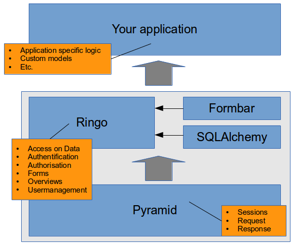
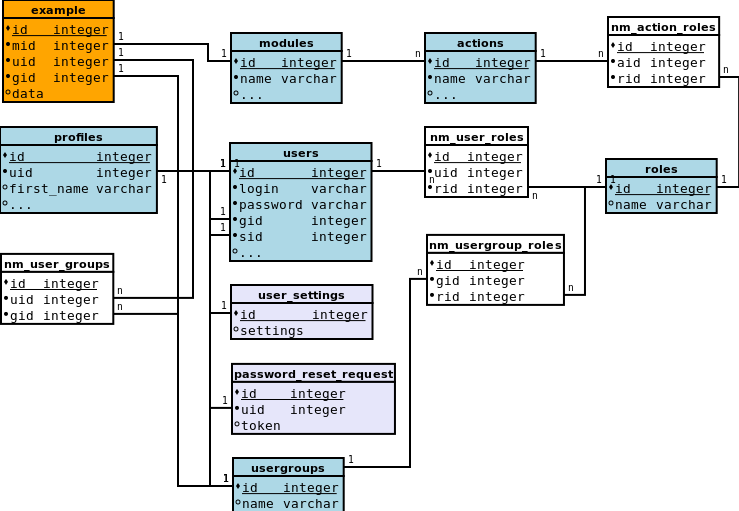

Architecture
************

Ringo is a Pyramid based application which can be extended to build your own
applications. This is a layered architecture where Pyramid brings in the basic
functionality like session handling and handling requests and responses in web
applications.  Ringo sits on top of Pyramid and provides commonly used
functionality often used in modern web applications.

.. note::

   Ringo is also a standalone application. You do not need to build another
   application on top of ringo to get something working to get an impression
   of ringo or start developing. Ringo is under steady development. This is a
   benefit if you use Ringo as base for your application. Your application
   will get bug fixes, new features or improved functionality in most cases by
   simply updating Ringo to a new version.

Ringo itself uses some external libraries to provide some of its
functionality. E.g the formbar library is used to build all forms and do
validation. The access to the database is done with the ORM SQLAlchemy.

A ringo based application is another pyramid based application which basically
extends ringo. See `Exending An Existing Pyramid Application
<http://docs.pylonsproject.org/projects/pyramid/en/latest/narr/extending.html>`_
for more details on how this is done.

All this magic is already done in a pyramid scaffold which comes with ringo.
Using this scaffold will create an application which uses ringo functionality
by simply importing it at the right places and take care the basic
configuration is done in the proper way.

.. _modules:

Modules
=======
The term "Module" is central and often used in ringo. Therefore it is important
to understand what a module is.

In short: Ringo's functionality is the sum of all modules
functionality. Ringo or a ringo based application can be extended by adding
new modules. If there is any data in the application which needs to be created
by the user and stored permanently in the database it is very likely done
within a modul.

**Example:** Think of an application to organise your orders in a shopping
application e.g. So you will have to store customers, articles, orders, prices,
addresses etc. Each of those will be its own modul.

.. image:: ../images/modules.png
   :alt: Schema of a module.

A module provides the infrastructure to work with a certain type of data in a
web application. Where certain type of data means users, files, movies etc.
rather than integers or datevalues. Lets call them items from now on.

Basically a module consists of

 * a model for the items you want to work with
 * views to handle incoming request and generating the proper responses for
 * templates which define how the pages in the application will look like. 
 * configuration files to define how the forms and overview tables will look like.

.. _crud:

CRUD actions
------------
Modules provide actions which can be used to manipulate the item of a module.
Ringo provides some basic CRUD [#]_ actions which are available on default for every module.

* Create: Create new items.
* Read: Show the item in detail in readonly mode.
* Update: Edit items of the module.
* Delete: Deleting items.
* List: Listing all items of the module. This is slightly different to the action to read a single item.
* Import (CSV, JSON)
* Export (CSV, JSON)

.. [#] CRUD means: Create, Read, Update, Delete

Extensions
==========
.. automodule:: ringo.lib.extension

A list of available extensions can be found on `Github
<https://github.com/ringo-framework>`_. Repositiries named `ringo_*` are
extensions.

.. _mixins:

Mixins
======
.. automodule:: ringo.model.mixins

.. _mixin_meta:

Meta
----
.. autoclass:: ringo.model.mixins.Meta

.. _mixin_owned:

Owned
-----
.. autoclass:: ringo.model.mixins.Owned

.. _mixin_nested:

Nested
------
.. autoclass:: ringo.model.mixins.Nested

.. _mixin_logged:

StateMixin
----------
.. autoclass:: ringo.model.mixins.StateMixin

Security
========
Security is an important aspect of ringo. This chapter will describe the
permission system and explains how ringo handle common security threats.

.. _permissionsystem:

Permission System
-----------------
The permission system addresses two basic questions:

1. **Who is allowed** to access some item in general and
2. **What is allowed** for the user to access, in case he is generally allowed
   to access the item.

To answer these two questions the permission system of Ringo is a combination
of concepts of the permission system known from the `Unix file system  <http://http://en.wikipedia.org/wiki/File_system_permissions>`_ and a
`roles based permission system <http://http://en.wikipedia.org/wiki/Role-based_access_control>`_.

.. image:: ../images/permissions.png
   :width: 500
   :alt: Activity diagram of the permission check.

The Unix file system part answers the first question: Who is allowed? Therefor
every item in the system inherited from the :ref:`mixin_owned` stores
information to which owner and which group it belongs to. Only the owner,
members of the group or users with an administrational role are granted access
to the item in general.

After the permission to access the item in general is allowed, the role bases
system answers the second question: What is allowed. The permission system
will now check which :ref:`roles` the users have and which actions are allowed for
these roles.

If the user is the owner of the item, or is member of the items group, then
all permissions of the users roles will be applied.

.. index::
   double: Authentification;Roles
.. _roles:

Roles
-----

.. autoclass:: ringo.model.user.Role

.. _authentification:

Authentification
----------------
Authentication is done once in the login process. If the user has logged in
successful an auth cookie is saved. From then on the user object is loaded
from the database on every request with the roles and groups attached to the
user.  This user object is used later for the Authorisation. If the user is
not logged in the user object is empty.

The authentification has a default timeout of 30min. The timeout will be reset
after every new request of the user. The timeout can be configured in the
application configuration bei setting the 'auth.timeout' config variable.

.. index::
   double: Authentification;Anonymous Access
.. _authorisation:

Anonymous Authentification
^^^^^^^^^^^^^^^^^^^^^^^^^^
On default Ringo does not provide an anonymous access to the application
(Despite of some static pages). So you must login before you can work with the
application and have appropriate permissions.

Anonymous access in Ringo is implemented by using a Proxy-User. This user must
be existent in the database and properly configured. To enable anonymous
access to the application you must configure this user as anonymous user. See
:ref:`anonymous_access` for more details.

If enabled every request to the application will automatically be 
authenticated with the configured anonymous user (As long as the User is not 
already logged in). The request will be done with all configured permissions 
of the roles the configured anonymous has. So you can configure in details 
which permissions a anonymous user will have.

.. warning::
        Be careful with the configuration of the anonymous user. Double check
        the permissions of the anonymous user and check the configuration in
        the ini file and make sure you did not configure a high privileged
        user like the admin as anonymous user.

To implement an anonymous access to the application you will need to do
three things:

1. Create a dedicated user which will be used as the anonymous user.
2. Create roles with appropriate permissions on the different modules to
   grant this anonymous user access on the data. Please note, that these
   roles must be "admin"  roles to disable the owner/group check on
   authorisation as we want the anonymous user to be able to basically
   all items. The only restriction is than configured by the permissions
   of the role.
3. Enable this anonymous user in the `ini` file.

Authorisation
-------------
The permission system in Ringo uses the Pyramid `Pyramid Authorisation and
Authenfication API <http://docs.pylonsproject.org/projects/pyramid/en/latest/api/security.html>`_

Authorisation is done on every request. The authorisation will check if the
user is allowed to access the requested resource.

A resource is an url or an item which is accessed by calling the url in your
application.  In all cases this resource is build from a resource factory for
every request.  Every resource will have an ACL which determines if the user of
the current request (See :ref:`authentification`) is allowed to access the
resource.

Ringo's part in the authorisation process is to build the ACL. This ACL is
then used by the Pyramid security API. Therefor ringo implements helper
functions to build ACL lists which model the ringo permission system.

See `Adding Authorization tutorial
<http://docs.pylonsproject.org/projects/pyramid/en/latest/tutorials/wiki2/authorization.html>`_
for more information how things work in general under the hood.

See :mod:`ringo.lib.security` for documentation on helper functions used to build
the ACL.

Security measurements
=====================
Ringo has protection against common threads of webapplication included.

CSRF-Protection
---------------
To protect against CSRF attacks ringo follows the recommodation of `OWASP
<http://url>`_ and adds a synchroniser token to each form, which will be sent
and checked on each POST request. The token will be unique on every request.
GET requests in ringo are not protected as GET functions in ringo should be
idempotent and does not trigger expensive opertaions. Following this simple
philosophie on GET requests will make any further CSRF protection obsolete.

XSS-Protection
--------------
Ringo will add the following headers to protect the application against XSS attacks.

 * 'X-XSS-Protection': '1; mode=block',
 * 'X-Content-Type-Options': 'nosniff'

Further ringo provides an option to enable a contect CSP for further
protection. The CSP is disabled on default but can be enabled in the
application :ref:`conf_headers` configuration.

Clickjacking-Protection
-----------------------
Cookie and Session security
---------------------------

DOS-Protection
--------------
DOS protection is not handled by ringo. Protection against DOS-attacks should
be handled by the Reverse Proxy or Firewall.

Basic DB Schema
---------------
Below you see the basic schema of the ringo database. The schema only lists
some central tables which help to understand how the things are wired together
in ringo. The table colored orange `example` table in the top left is an
example for any other table which will store items of a modul.
Every item of an item has a reference to the module it belogs to. Further the
current example has a reference to a user and a usergroup which defines the
ownership [#]_ per item is is important for the authorisation.

Let us begin with the `modules` table. This table will store information on
all available modules in the system. It basically stores the configuration per
modul.  As described in the :ref:`modules` section each modul has
(:ref:`crud`) which are stored in the `actions` table. The NM-table
`nm_actions_roles` define which `roles` are allowed to use the actions in the
module. See :ref:`permissionsystem` for more information on how the
:ref:`authorisation` is implemented in ringo.

The `users` table stores all the users in ringo. The users table only holds
minimal data which is required for authentification and authorisation.
Additional information like the name, email etc. is stored in the `profiles`
table. Every user has a profile.

Users can be organised in groups using the `nm_user_groups` table. All
usergroups are stored in the `usergroups` table. Roles can be assigned to
usergroups and users. This is done with the NM-table `nm_user_roles` and
`nm_usergroup_roles`.

The table `user_settings` and `password_reset_request` are helper tables to
save user settings like saved search queries or store the tokens to trigger
the password reset.

.. [#] The ownership feature can be added by using the :ref:`mixin_owned`
   mixin.

States and Workflows
====================
.. automodule:: ringo.model.statemachine

.. index::
   double: Configuration; Application
