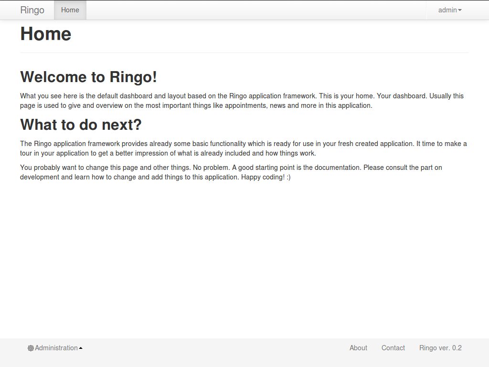
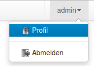
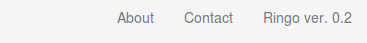
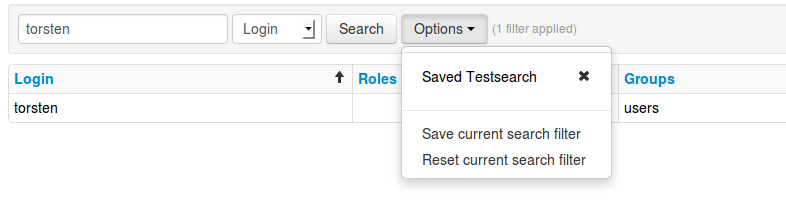

******************
Elements of the UI
******************
This chapter will give an overview of user elements in the basic ringo user
interface (UI) and how to use them.

Below you can see an example of a view in the Ringo application.

The Ringo UI is divided into three areas. In the top there is a header. At the
bottom the footer and in the middle there is the content.

Main Menu
=========
The Main Menu will list the link to the :ref:`ui-home` page of your
application and a entry for all available and enabled non administrational
:ref:`modules`. The links will usually link the :ref:`ui-overview` page of the
selected modul.

.. image:: screenshots/ui/mainmenu.png

The currently active modul is highlighted.

.. _ui-user-menu:

User Menu
=========

The User Menu is only visible for logged in users. The Menu will give access
to user specific functions.

The label of the menu shows the login name of the currently logged in user.
These are:

 * Profil: Will open the Profil of the user.
 * Change Password: Will open a dialog to change the users password.
 * Logout: Will logout the user

Context Menu
============
The context menu will provide available actions for the currently selected
item, or more generally speaking for the currently displayed page.

The available actions can be configured in the :ref:`modul-modul` administration.

.. image:: screenshots/ui/contextmenu.png

The following actions are currently availabe in Ringo. Listed from left to right:

 1. Overview: Go back to the overview of the modul.
 2. Add new item: Will open the page to create a new item of the modul.
 3. Read item: Will open the currently selected item in read only mode.
 4. Edit item: Will open the currently selected item in edit mode.
 5. Delete item: Will delete the currently selected item.

Administraion Menu
==================

.. image:: screenshots/ui/administrationmenu.png

The Administraion Menu is only visible for users with the "admin" role after
login. It gives access to the administration of the modules.

.. _ui-footermenu:

Footer Menu
===========

The Footer menu gives general information on your application like how to
contact you or version information.

.. _modules:

Overviews
=========
Each modul has an overview page which lists all items of the modul. Each
overview provides the following functionality:

 1. Sorting
 2. Searching
 3. more will to be implemented...

To open one of the shown items in the overview you can click simple somewhere
in the row. The item will be opened in read mode. Note that you need to click
on the row and not on the value as this triggers a search. See more details below.

Sorting
-------
The header of the overview table is clickable to sort the listing on the
selected header. Clicking on the header toggles between ascending and
descending sorting. A small icon shown on which column the sorting was done.

Searching
---------
The search is based on the visible values in the overview. That means you can
search for anything which is displayed in one of the columns. If the search
string matches at least one value in the column the item will be found and
displayed in the overview.

The search can be a regular expression. Optionally you can select a specific
column to restrict the search an this column. On default the search is done
over all visible columns.

.. hint::
   You can also a search by clicking on the literal value in a column. This
   will trigger a new search for the clicked value in the corresponding
   column.

The search is stackable. This way you can narrow down your search by refining
your search by doing another search on the last search result. You can see how
many filters are currently applied next to the options drop-down.
To pop the last filter from the search stack simply enter a empty search.
To reset the whole search stack at once select the "Reset current search
filter" option from the options drop-down.

You can save your current search under a user defined query name and make it
available for later use. This becomes very handy if you are in the need of
some often used predefined searches.

.. note::
   You can only save a search which actually has at least one found item in
   the search result. Further the name for your query must be unique. It is
   not possible to edit a saved search. You need to save it under a new name.

To save the current search stack, select the "Search current search stack"
option from the options drop-down. You can enter your desired name for the
query and then save it in your user settings.
The saved searches are then listed in the options dropdown. You can delete a
saved search by clicking on the cross symbol next to each filter.
