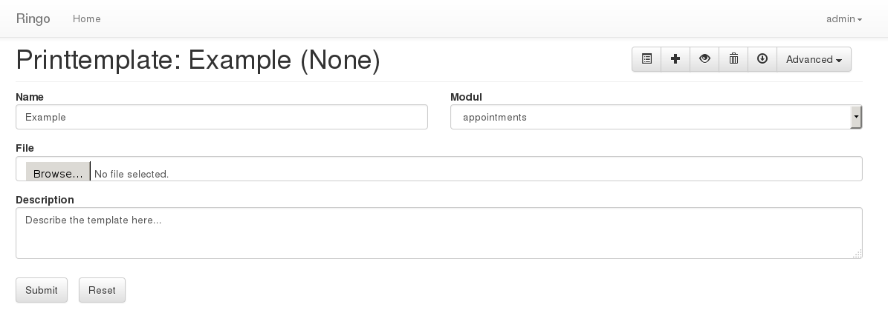
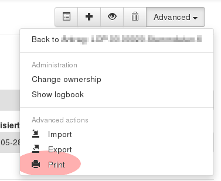

*****
Usage
*****

This section will give help on how to use speficig features in ringo.

General
=======

Read and Update Mode
--------------------
Items can be opened in read and update mode. I read mode all fields are
rendererd as readonly fields and no editing is possible regardless of your
current permissions. In updated mode the fields are usual editable but further
constraint in the form of the items can turn single fields into readonly mode.

Printtemplates
==============
Printtemplates can be used to print items in a visual nice way. You can define
a Printtemplate and define variables in the template which will be replaced
with values from the item you want to print. All values of the item which are
available in the :ref:`usage_iexport`.

.. note::
   Printtemplates are Files in the Open Document Format because of portability
   reasons. There is currently no option to generate files in a different format.

All modules which inherits from the :ref:`mixin_printable` Mixin will have
this functionality.

Please ensure that all users who should have access to the printtemplate must
have at least the ``read`` permission for the Printtemplates in one of their
roles and must be the owner or member of the templates user group.

=========== ===========
Field       Description
=========== ===========
Name        The Name of the template
Modul       Optional. If you select a modul then this printtemplate will be only available for items of this modul
Description Give a short description of the template.
File        The template file. You can replace a existing template file by uploading a new file.
=========== ===========

.. rubric:: Print an item

Only printing of single items is currently supported.

To print an item you need to select the item first. In the context menu will
be the print option available. After selecting this action a pop up window
will give you the option to choose from a list of available templates for this
modul.

.. rubric:: How to create a new template
The creation of print templates is easy. Basically you must create a ODT File
with some special markup. The following steps describe the process in the
Libreoffice Writer:

1. Create a new ODF document and layout it in the way you need it.
2. For each value which should be added in the document you need to define a
   user variable. Press ``CTRL+<F2>`` and create a new user variable. The name
   of the varibale must be ``py3o.item.<fieldname>``, where ``<fieldname`` is
   the name of a items field (See export). The value of the variable is
   ``item.<fieldname>``.
3. Now insert these variables on every location in your document where you
   want want a value be replaced with the items value.
4. Store the document und upload it into ringo as Printtemplate.

The Printtemplates are based on the `py3o library <http://pypi.python.org/pypi/py3o.template>`_. See this website for more information and documentation.
A  :download:`example template <misc/printtemplate_example.odt>` including some basic fields of the template is available.

.. _usage_iexport:

Import and Export
=================
