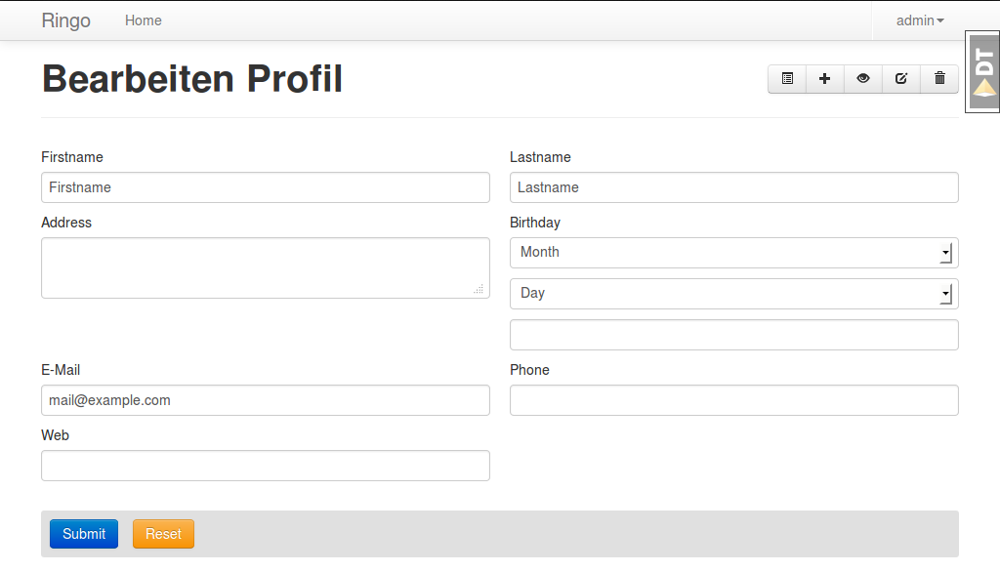
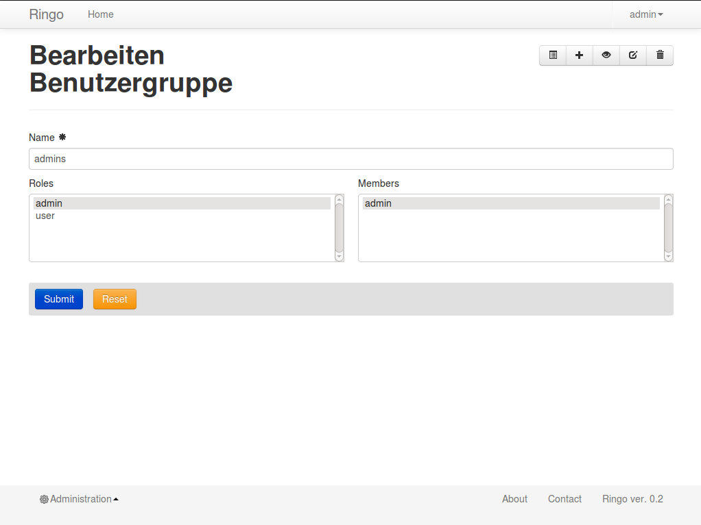
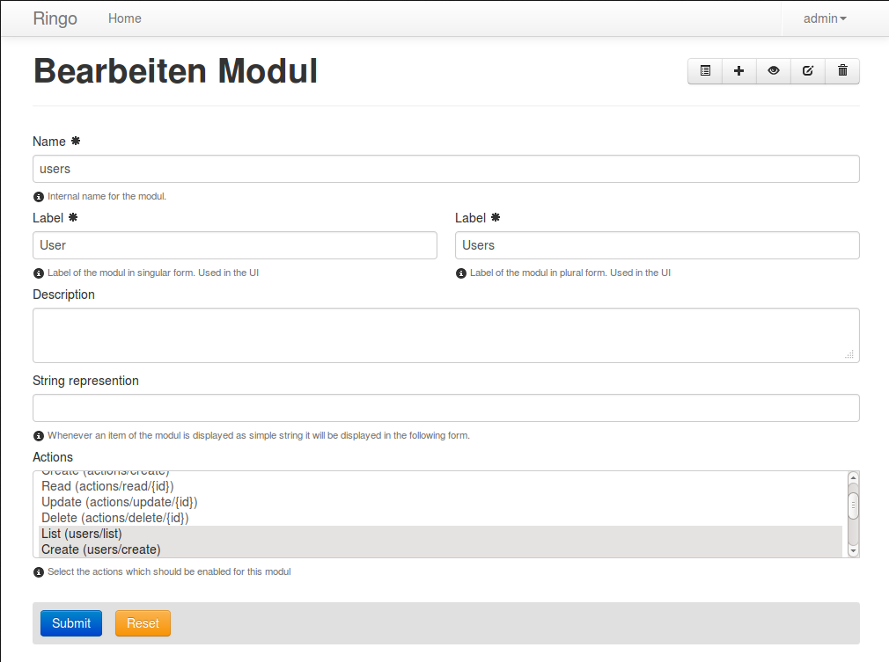

UI
**
This section will explain the User Interface of Ringo. This will introduce
some Ringo specific terminology which is used later in the documentation.

Below you can see an example of a view in the Ringo application.

.. image:: screenshots/home.png
   :width: 800
   :alt: Ringo after login 

The Ringo UI is divided into three areas. In the top there is a header. At the
bottom the footer and in the middle there is the content.

.. _modules:

Modules
*******
.. image:: images/database.png
   :alt: Basic database model.

Ringo uses the term "Modul" to describe different data (data types) in your
application.  Ringo comes with some predefined modules for users, usergroups,
roles and the modules itself.  Each of those moduls provide an interface with
basic CRUD functionality of work witch items of a modul.

.. image:: images/applayers.png
   :alt: Schema of a modul.

Moduls also define some meta data on the data like which actions (Create,
Read, Update, Delete...) are available, labels, visibility etc.  Further the
authorisation is bound to the moduls too and defines and which users are
allowed to use the configured actions.

.. image:: images/modules.png
   :alt: Schema of a modul.

If there is any data in the application which needs to be created by the user
and stored permanently in the database it is very likely done within a modul.

Example:: Think of an application to organise your orders in a shopping
application e.g. So you will have to store customers, articles, orders, prices,
addresses etc. Each of those will be its own modul.

See :ref:`commands` for more information on how to add new moduls to your
application.

.. _modul-users:

User
====
The user modul is used to administrate the users within Ringo. It is only
available for user with the role "admin".

.. image:: screenshots/user.png
   :width: 800
   :alt: Edit dialog of a user.

The screenshot shows the Edit-Dialog for a user.

 * Login: This is the login name for the user. It is a required field and must be unique in the system.
 * Roles: Each user can have different roles assigned. You can select one or more roles for a listing of available items of the :ref:`modul-roles`.
 * Groups: Each user can be member of different groups. The user will inherit all roles assigned to the group. You can select one or more groups for a listing of available items of the :ref:`modul-groups`.
 * Activated: The user can be activated and deactivated which means that the the user can login to the application.
 * Activation Token: In case the the user is deactived you can define an activation token (usually a UUID) which can be used to activate the user.  This field is used while registering a new user. The user needs to confirm the registration by calling an URL with the defined activation token.

.. _modul-profile:

Profile
=======
The profile modul is used to administrate the users profiles in Ringo. It is only
available for user with the role "admin" and the owner of the profile (user
with belongs to the profile).

The profile is used to attach some additional common informations to the users in the system.

Profiles can not be deleted or created. The creation and deletion is done
automatically when creating and deleting the user.

The screenshot shows the Edit-Dialog for a profile.

 * Firstname: The first name of the user
 * Lastname: The last name of the user.
 * Birthday: The birthday of the user.
 * Address: A free text field to give the address of the user.
 * Phone: The telephone number.
 * Email: The users email. Is used to send notification mails in the system.
 * Web: A URL to the users web presence.

.. _modul-groups:

Usergroup
=========
The usergroups modul is used to administrate the usergroups within Ringo. It is only
available for user with the role "admin".

Groups can be used to assign a defined set of roles to multiple users. Further
the membership of groups can be a criteria on the permission checks.

The screenshot shows the Edit-Dialog for a usergroup.

 * Name: This is the name for the usergroups. It is a required field and must be unique in the system.
 * Roles: Each usergroup can have different roles assigned. You can select one or more groups from a listing of available items of the :ref:`modul-roles`. A user will have all the roles of the groups he is member of.
 * Members: Define the members of the usergroup. You can select one or more groups from a listing of available items of the :ref:`modul-users`

.. _modul-roles:

Role
====
The roles modul is used to administrate the usergroups within Ringo. It is only
available for user with the role "admin".

Roles are generally used to bind certain permissions in the application to
different users. Users who have a certain role will gain the defined permissions.
For more information on the authorisation please consult the
:ref:`authorisation` section.

.. image:: screenshots/role.png
   :width: 800
   :alt: Edit dialog of a role.

The screenshot shows the Edit-Dialog for a role.

 * Name: This is the name for the role. It is a required field and must be unique in the system.
 * Permissions: Each role can be assigned the permissions to different actions of the moduls in the system. You can select one or more actions from a listing of available and configured actions from the :ref:`modul-modul`. Users with this role will be allowed to call the action.
 * Administrational role: This flag indicates that this role is an administrational role which means that the user will have permission to call the configured actions without checking the ownership of the item.

.. _modul-modul:

Modul
=====
The modul modul is used to administrate the moduls within Ringo. It is only
available for user with the role "admin".

The screenshot shows the Edit-Dialog for a role.

 * Name: This is the internal name of the modul. It is a required field and must be unique in the system.
 * Label singular: This is the label used for single items of the modul.
 * Label plural: This is the label used for multiple items of the modul (Overviews).
 * Description: A textual description of the modul.
 * String representation: The string representation defines how items of the modul are displayed as a single string like in selection lists.
 * Actions: A list of actions which are available for the Modul. This way you can disable an action complete. Not enabled action will not be listed anywhere.
 * Display: Select the menu where the modul will be listed. Select hide to hide the modul completely

Permission System
*****************

.. _authendtification:

Authentification
================

.. _authorisation:

Authorisation
=============

.. _commands:

Commands
********
Ringo implements some additional commands which can be used on the shell.

.. _commands_add_modul:

add_modul
=========
The "add_modul" command is used to add :ref:`modules` to your application. The
command will do needed database modifications and create some skeleton files
within your projects as boilerplate for further development.

Usage::

        add_ringo_modul --config /path/to/your/application-config.ini NameOfModul

.. important::
The name of the modul should be the singular form of a noun.

The actual name of the command may vary if you want to add a modul your a
Ringo based application. Please call the command with "--help" option to get a
full list of available options.

API
***
lib
===
.. automodule:: ringo.lib.renderer
   :members:
   :inherited-members:

Scaffolds
*********

.. _scaffold_basic:

Basic Scaffold
==============
